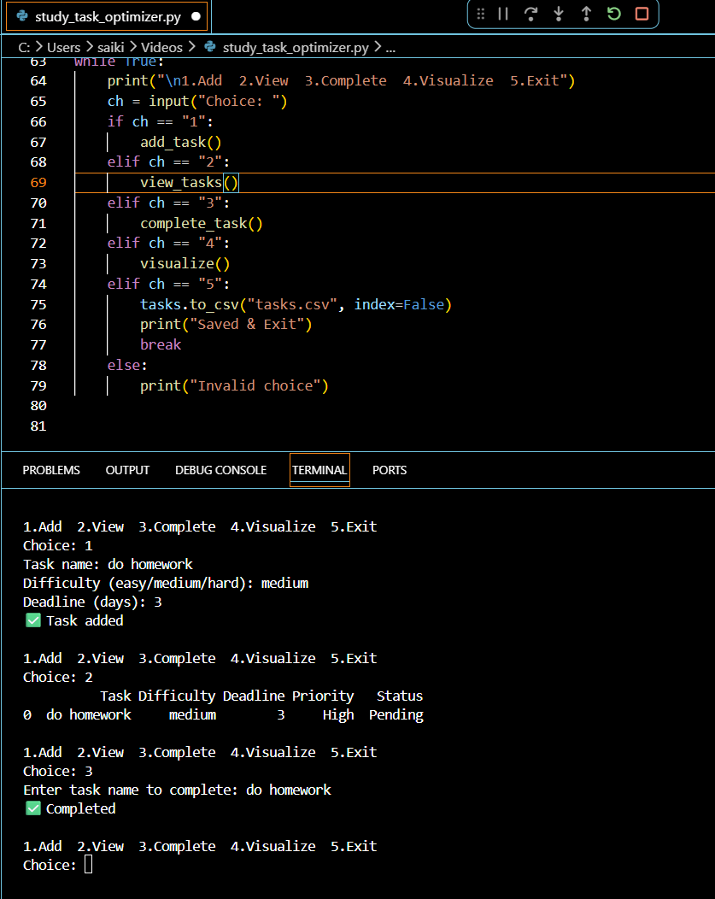

# 📚 AI Task / Study Optimizer

## 📌 Description
AI Task / Study Optimizer is a Python-based intelligent task management system that helps students and professionals organize, prioritize, and track tasks efficiently. It analyzes priorities, deadlines, and time requirements to improve productivity and task planning.

## ✨ Features
✔️ Add tasks with priority, category, estimated time, and deadlines  
✔️ Automatically prioritize tasks based on urgency and importance  
✔️ Visualize task progress and distribution trends  
✔️ Store tasks using CSV files for easy management  
✔️ Improve productivity with smart task organization  

## 🛠️ Technologies Used
- Python 3.x  
- Pandas  
- NumPy  
- Matplotlib  

## 🚀 How to Run

```bash
# Clone repository
git clone <repo_url>

# Install dependencies
pip install -r requirements.txt

# Run project
python task_optimizer.py

# or
python main.py
```
---

## 📸 Project Screenshot
 

---
## 👨‍💻 Author
**Gaddamidi Sai Kiran**

## 📄 License
Licensed under the MIT License.
